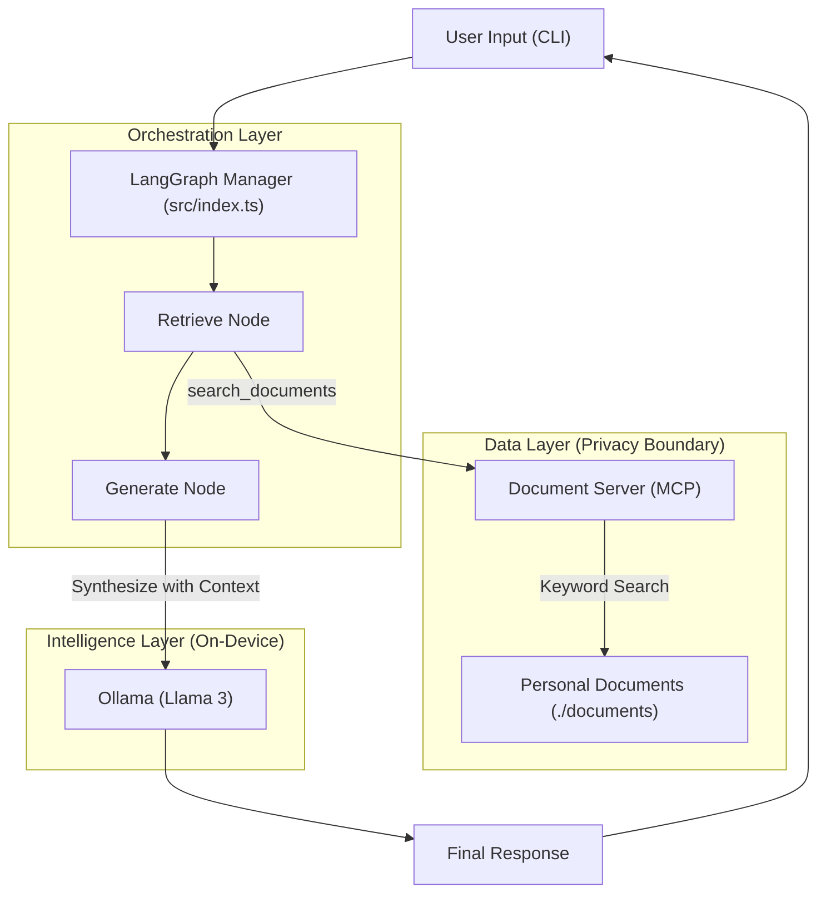

# System Architecture: Personal Knowledge Assistant

This document explains the technical architecture of your "Second Brain," focusing on privacy, local execution, and agentic orchestration.

## High-Level Flow
The system operates as a **local-first RAG (Retrieval-Augmented Generation)** loop. Every query follows a strict "Retrieve then Generate" path to ensure the local model has access to your private facts.

## Key Components

### 1. LangGraph Manager
The "Controller" of the brain. It manages the state (message history) and ensures that for every user question, a search is performed *before* the LLM is asked to answer. This prevents "hallucinations" about your personal data.

### 2. MCP Document Server
A standalone Model Context Protocol server. It exposes a `search_documents` tool. 
- **Current**: Uses a memory-safe keyword search.
- **Planned**: Upgrade to vector-based search (ChromaDB) in future milestones.

### 3. Ollama (Local LLM)
The reasoning engine. By pointing the LangChain SDK to `localhost:11434`, we ensure that your private documents never leave your hardware. No cloud APIs are used for synthesis.

---

## Data Privacy
> [!IMPORTANT]
> Because both the **Document Server** and **Ollama** run locally, your data is never sent to external servers. This architecture is designed for security-sensitive personal knowledge.
